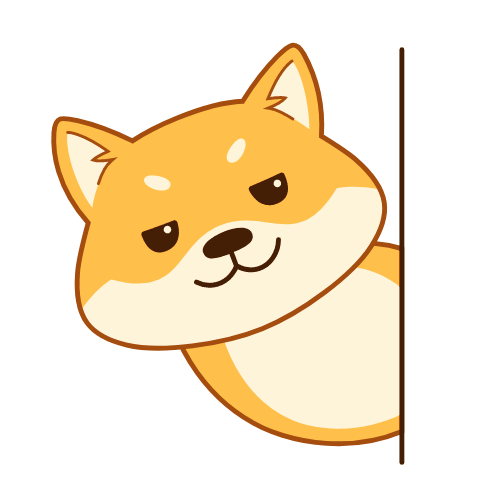

<h2>Michael Rowlinson 👋😎🤙</h2>
<h3>Solution Architect 💯🎉</h3>

<ul>
<li>🔭 I’m currently working on Enterprise SaaS solutions in AWS</li>
<li>🏋️ Actively honing my skills in Serverless technologies</li>
<li>📫 Reach out to me on <a href="https://www.linkedin.com/in/michaelrowlinson/" target="_blank">LinkedIn</a></li>
</ul>

<!--
**rowlinsonmike/rowlinsonmike** is a ✨ _special_ ✨ repository because its `README.md` (this file) appears on your GitHub profile.
-->
